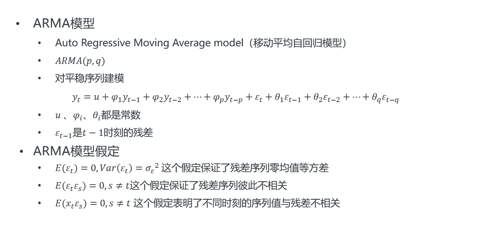

# 数据挖掘

[TOC]

## 数据分析

### 数据分布可视化

直方图

密度曲线图

箱型图

小提琴图

### 相关性分析与独立性检验

### 案例：时间金融数据分析过程

时序图绘制（周期性、倾向性）

分布图与小提琴图、频率直方图（中位数、众数）

相关性分析

月分布、周特征（折线图、热力图）

节假日

异常交易、大额交易与小额交易

收益与交易量

地区、性别、出生月特征

## 时序信息

基于周期性预测

时间序列分解（加法结构、乘法结构、混合结构）

ARIMA模型

## 特征工程

SHAP 分析特征重要性

## 模型训练

数据集划分（T，V，T）

模型：线性回归、决策树回归、梯度提升树、Lightgbm

